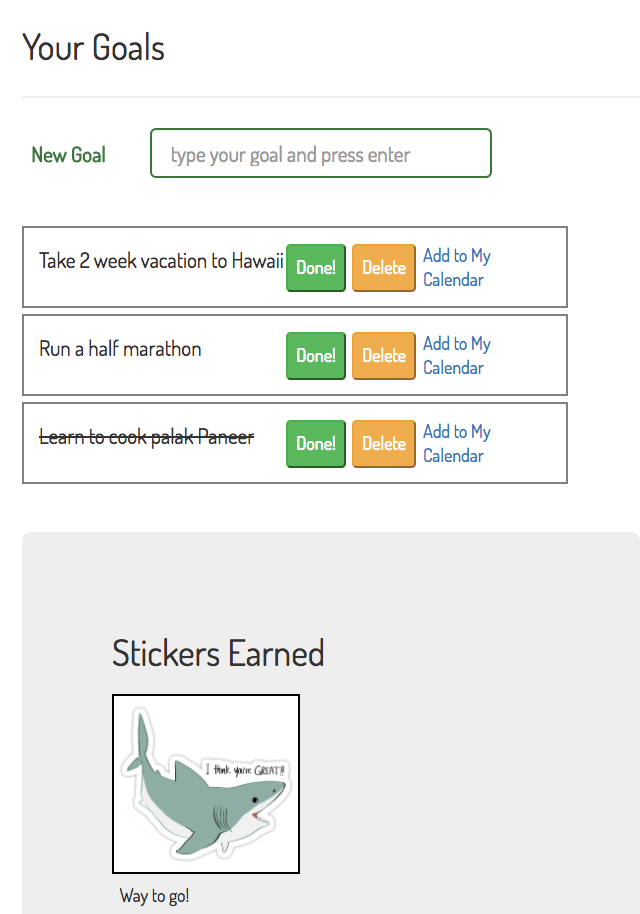

# Sixty-Six-Days Full Stack App

A full stack JavaScript app that lets users log in and track their goals. As they check goals off they receive stickers and motivational quotes as a reward.




## Technical

The app is built with full-stack JavaScript. The front-end uses HTML5, CSS, React and Redux. The back-end uses NodeJS with ExpressJS as the web server and MongoDB as the database.

## Development Roadmap

This is v1.0 of the app, but future enhancements are expected to include:

* Extending the app to allow users to pair with friends on goals and chat about their progress.
* Extending the app to provide monetary exchanges.

## Getting started

### Setting up the project

* Clone this repository: `git clone https://github.com/davellaj/sixty-six-days.git`
* Install the dependencies: `npm install`

### Working on the project
* Run the development task: `npm run dev`
    * Starts a server running at http://localhost:8080
    * Automatically rebuilds when any of your files change

## Directory layout

```
.
├── client      Client-side code
│   ├── assets  Images, videos, etc.
│   ├── js      JavaScript
│   └── scss    SASS stylesheets
├── server      Server-side code
└── test        Tests
    ├── client  Client tests
    └── server  Server tests
```

## Deployment

App is deployed using Heroku. [https://sixty-six-days.herokuapp.com](https://sixty-six-days.herokuapp.com/).
